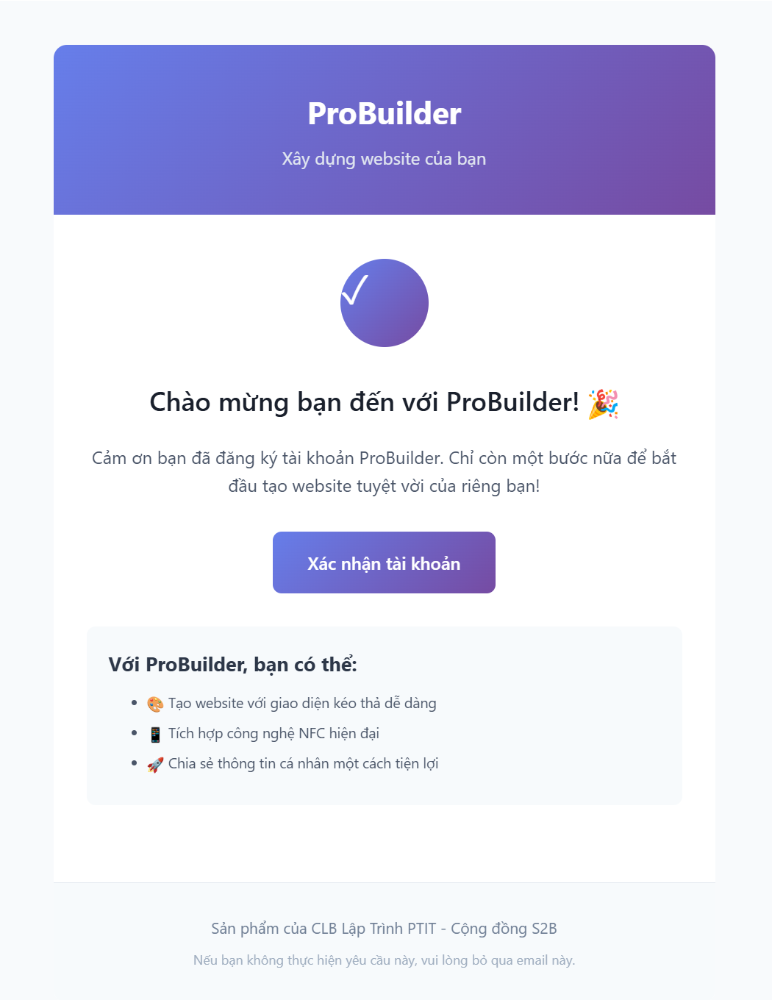
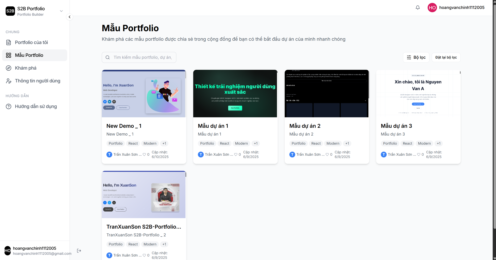
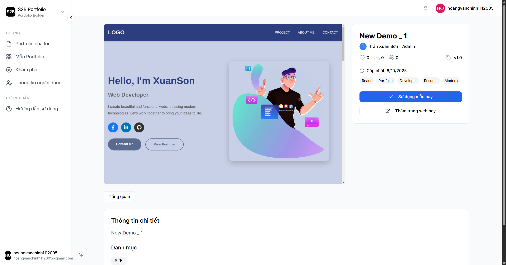
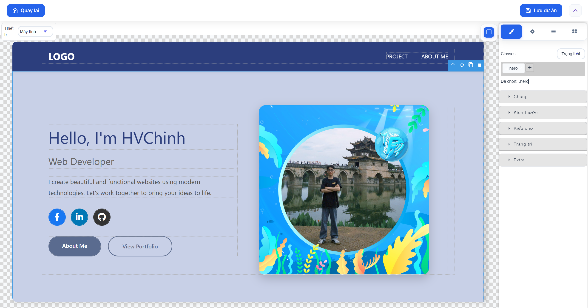
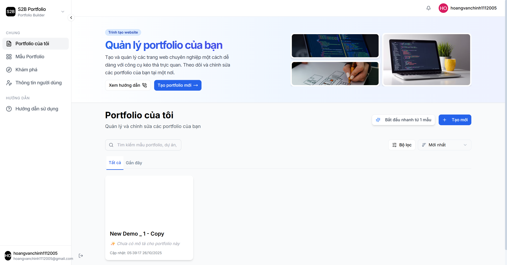
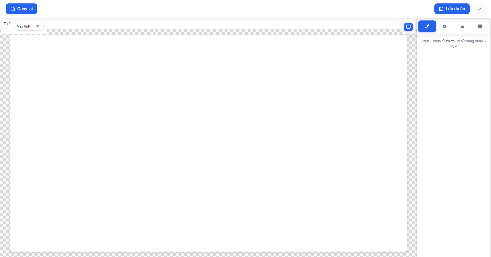
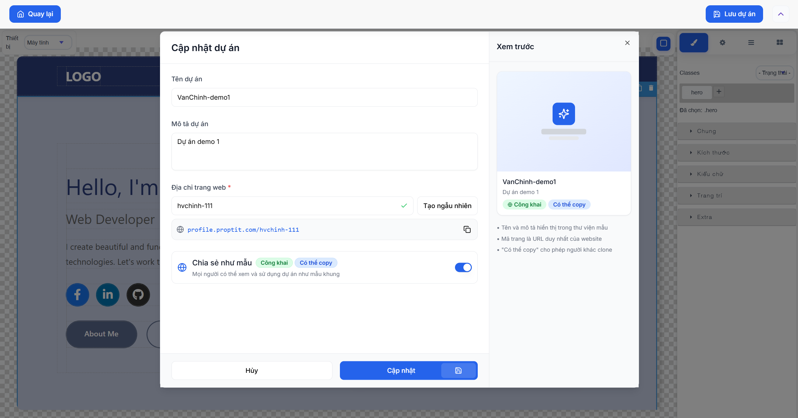
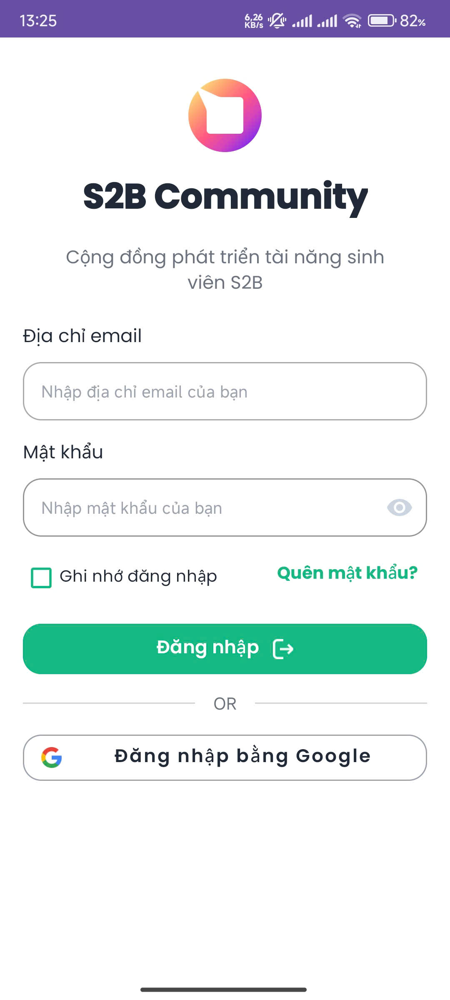
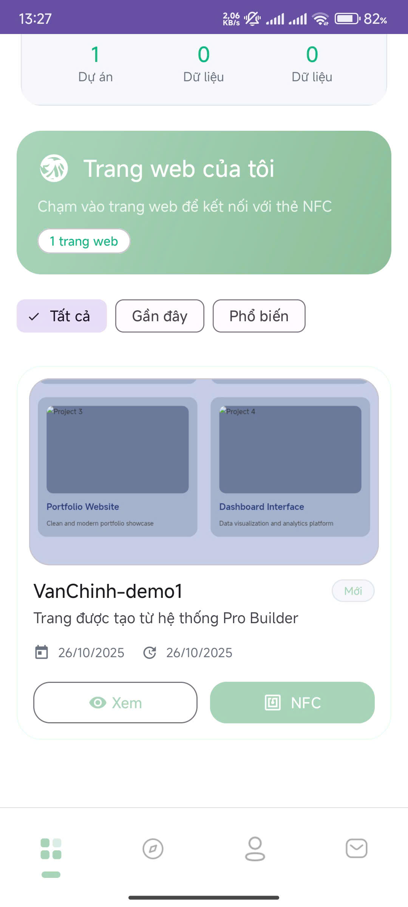
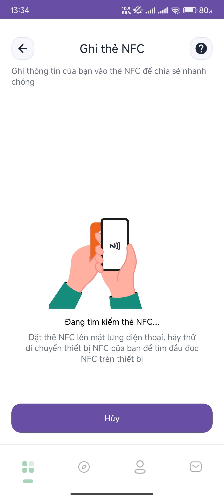

# Hướng dẫn sử dụng web

## Bước 1: Tài khoản
> Thiết lập và xác nhận tài khoản

Tài khoản người dùng sẽ được Admin cung cấp. Sau khi được tạo tài khoản, người dùng hãy truy cập Gmail và click vào link xác nhận.

Password mặc định: **11111111**

## Bước 2: Trường hợp 1: Tạo dự án từ mẫu có sẵn
> Sử dụng template có sẵn để tạo dự án nhanh chóng

1. Xem danh sách mẫu có sẵn
Từ *"Portfolio của tôi"* click vào *"Bắt đầu nhanh từ 1 mẫu"* hoặc vào *"Mẫu Portfolio"*

2. Chọn 1 mẫu ưng ý
Chọn mẫu bạn muốn sử dụng và click vào *"Sử dụng mẫu này"*

3. Chỉnh sửa thông tin
Sửa thông tin bằng cách double click vào từng đối tượng

## Bước 3: Trường hợp 2: Tự tạo dự án hoàn toàn mới
> Bắt đầu với dự án hoàn toàn mới, bỏ qua nếu bạn đã tạo dự án từ mẫu

1. Click vào: *"Tạo mới"* hoặc *"Tạo Portfolio mới"*
Tạo 1 dự án hoàn toàn mới

2. Bắt đầu xây dựng trang web của bạn
Chi tiết cách xây dựng đọc thêm trong hướng dẫn sử dụng **Builder**

## Bước 4: Lưu dự án và chia sẻ template của bạn
> Lưu dự án của bạn và chia sẻ template bạn thiết kế với mọi người nếu muốn

1. Click *"Lưu dự án"*
Lúc này một cửa sổ nổi sẽ xuất hiện

2. Điền thông tin
Điền các thông tin cần thiết: tên dự án, mô tả dự án, địa chỉ trang web của bạn

3. Chia sẻ template của bạn
Nếu muốn chia sẻ template mà bạn thiết kế cho mọi người, hãy bật chế độ *"Chia sẻ như mẫu"*, dự án sẽ được chia sẻ công khai với cộng đồng

## Bước 5: Kết nối trang web với thẻ thành viên
> Kết nối trang web với thẻ thành viên của bạn bằng NFC qua ứng dụng **"S2B Community"**

1. Cài đặt ứng dụng **"S2B Community"**

2. Đăng nhập
Đăng nhập bằng tài khoản & mật khẩu giống với web builder.proptit.com

3. Click vào *"Thẻ thành viên"*
Lướt xuống để xem các dự án mà bạn đã tạo trên web builder.proptit.com

4. Bật NFC trên điện thoại, click nút *"NFC"* tại trang web bạn muốn kết nối
Đưa thẻ thành viên của bạn ra sau mặt lưng điện thoại để kết nối trang web với thẻ của bạn
